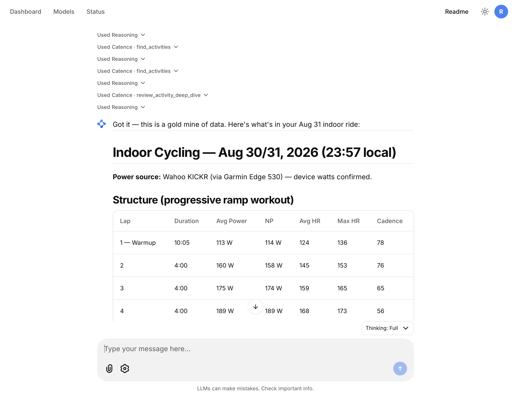

# Catence

Catence is a local-first fitness MCP server for Garmin, Intervals.icu, and targeted Strava enrichment. It gives an agent evidence-backed access to normalized training, wellness, activity, stream, segment, and gear data without uploading the underlying dataset to Catence.



## What is included

- Garmin, Intervals.icu, and Strava ingestion with source-aware normalization.
- Read-only MCP tools, plus explicitly named, lock-guarded write tools for Strava hydration and detached syncs.
- One shared Catence agent can serve several isolated athlete stores. Every personal-data MCP call names an `athleteId`; Catence never silently combines athletes.
- A password-protected Chainlit Console with an authenticated dashboard, a data-sync button with live progress, and in-app model management.
- A generated demo catalog for safe evaluation in Glama, desktop MCP clients, or local development.

Catence helps explore recovery, training load, trends, activity detail, swimming/cycling/running progress, segments, gear, and data quality. It reports the evidence and coverage it can see; it does not diagnose or prescribe training.

## Requirements

- Node.js 22+
- Python 3.12+ and [uv](https://docs.astral.sh/uv/) for Garmin and Strava provider workers
- Provider credentials for the athletes you choose to sync

## Quick start

Install Catence and create the first athlete. The default catalog home is `~/.catence`; set `CATENCE_HOME` or pass `--home` to use a different location.

Every `catence-data` command requires `--athlete <id>`; there is no default athlete. Pair it with `--home <dir>` to select the catalog when not using the default home.

```sh
npm install --global catence@beta          # or catence@latest for stable
catence-data setup --athlete alex --label "Alex"
```

Store each provider value through stdin so it does not enter shell history. Values are written to the selected athlete's owner-only local secret file.

```sh
printf %s 'alex@example.com' | catence-data --athlete alex secret set --provider garmin --field email --value-stdin
printf %s 'your-garmin-password' | catence-data --athlete alex secret set --provider garmin --field password --value-stdin
printf %s 'intervals-api-key' | catence-data --athlete alex secret set --provider intervals --field apiKey --value-stdin
printf %s '12345' | catence-data --athlete alex secret set --provider intervals --field athleteId --value-stdin
```

Sync and create retrieval context:

```sh
catence-data --athlete alex sync --provider all
catence-data --athlete alex build-retrieval-index
```

Start the stdio MCP server:

```sh
catence
```

An agent first calls `list_athletes`, then includes `athleteId` with every data tool. This is intentional: a shared agent may access the stores you configured, but no tool implicitly aggregates or crosses between athletes.

### Add another athlete

```sh
catence-data athlete add --id sam --label "Sam"
printf %s 'sam@example.com' | catence-data --athlete sam secret set --provider garmin --field email --value-stdin
printf %s 'sam-password' | catence-data --athlete sam secret set --provider garmin --field password --value-stdin
catence-data --athlete sam sync --provider garmin
catence-data athlete list
```

Garmin, Intervals, and Strava client credentials are isolated per athlete. Strava OAuth tokens remain in that athlete's own store. The old 0.1 single-store directory cannot be migrated safely: create a fresh home and re-sync each athlete.

### Common operations

```sh
catence-data --athlete alex status
catence-data --athlete alex sync --provider intervals
catence-data --athlete alex sync --provider garmin --from 2025-07-29
catence-data --athlete alex backfill --provider garmin --from 2020-01-01 --refresh
catence-data --athlete alex retry --run <run-id>
catence-data --athlete alex progress --watch
catence-data --athlete alex auth strava --callback
catence-data --athlete alex disconnect strava
catence-data update --check
catence-data update
```

## Documentation

| Document | Covers |
| --- | --- |
| [Deployment: local MCP](docs/deployment/local-mcp.md) | Install, catalog, secrets, sync, background progress, stdio/HTTP MCP, demo, common operations |
| [Deployment: local Console](docs/deployment/local-console.md) | Local web chat setup, model config, doctor, updates, troubleshooting |
| [Deployment: Docker](docs/deployment/docker.md) | One-container stack: deploy script, `.env`, sync.sh, MCP exposure (SSH/Tailscale), Cloudflare Tunnel |
| [Configuration](docs/configuration.md) | Complete `config.json` schema: rate limits, Strava budget, Console profiles, environment variables |
| [LLM providers](docs/llm-providers.md) | Model providers (OpenAI, Anthropic, OpenAI-compatible/Azure, Opencode Go/Zen), reasoning effort |
| [Architecture](docs/architecture.md) | Design rationale, layers, data flow, serving |
| [MCP activity retrieval](docs/mcp-activity-retrieval.md) | Implementation contract for answering questions, current tools, planned endpoints |
| [Distribution](docs/distribution.md) | Release artifacts: npm, PyPI, APM, MCPB |

## Safe demo and Glama

Run a clearly marked generated dataset without provider accounts:

```sh
npx --yes catence@beta demo
```

It creates or reuses `~/.catence-demo` with one `demo` athlete. The generated data has explicit caveats in every tool response and never contains personal measurements. The Glama registry entry uses this command for **Try in Browser**, so the hosted sandbox has no access to local credentials or personal data.

From a checkout:

```sh
npm run mcp -- demo
```

## MCP clients and HTTP

For a packaged installation, point a client at `catence`:

```sh
codex mcp add catence -- catence
claude mcp add --transport stdio catence -- catence
```

For a source checkout:

```sh
codex mcp add catence -- npm --prefix /absolute/path/to/catence run mcp
```

Optional local Streamable HTTP MCP and dashboard APIs:

```sh
catence serve --host 127.0.0.1 --port 8787
```

`GET /api/v1/athletes` returns IDs and labels only. `GET /api/v1/dashboard` requires `athleteId`, for example `http://127.0.0.1:8787/api/v1/dashboard?athleteId=alex&days=28`. Browser origins must be listed with `--allow-origin`; the packaged Console instead proxies the dashboard through its authenticated same-origin route. The MCP server has no authentication of its own — keep it on loopback or restrict it at the network layer (see [Docker MCP exposure](docs/deployment/docker.md#connecting-to-the-docker-based-mcp-from-outside) for the remote-access patterns).

## Configuration

[`config.example.json`](config.example.json) documents rate limits, Strava budgets, and Console model profiles. It intentionally contains environment-variable names rather than credential values. Keep per-athlete provider values in `catence-data secret set`, not in `.env` or `config.json`. The full `config.json` schema — including per-model reasoning effort — is documented in [`docs/configuration.md`](docs/configuration.md) and [`docs/llm-providers.md`](docs/llm-providers.md).

For source development:

```sh
npm ci
npm run check
npm test
UV_CACHE_DIR=$PWD/.cache/uv uv run --project console --group dev python -m pytest console/tests -q
```

## Beta releases

Registry betas use distinct npm, console, and UI-runtime prerelease formats. Each `catence@0.2.0-beta.N` npm release maps to a `catence-console==0.2.0bN` wheel, but the console depends on a range of `catence-chainlit` (the UI runtime), so the `catence-chainlit` version does not need to match the npm or console version. For example, `catence@0.2.0-beta.1` pairs with `catence-console==0.2.0b1` and can use any compatible `catence-chainlit` (such as `0.2.0b1`). The protected `beta` branch verifies candidates;
a `v0.2.0-beta.1` tag publishes to npm's `beta` channel and creates a GitHub
prerelease. Follow [the beta release checklist](release/beta-checklist.md) to
publish the UI wheel first, deploy the registry artifacts with Compose, and
test the MCP and authenticated Console on a server without touching production
data.

## Data and caveats

Garmin is the primary source for activity and wellness data; Intervals.icu supplements training analysis; Strava is used for targeted segments, efforts, and gear. Missing fields mean a provider did not supply a value. The source credentials and source APIs determine the data available. Catence does not use the official Garmin API; Garmin sync relies on the selected athlete's email/password credentials.

See [distribution notes](docs/distribution.md) for release artifacts, including APM and MCPB demo bundles.